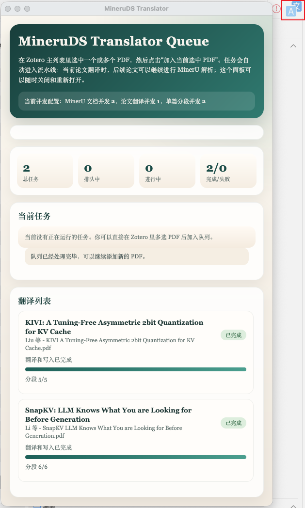
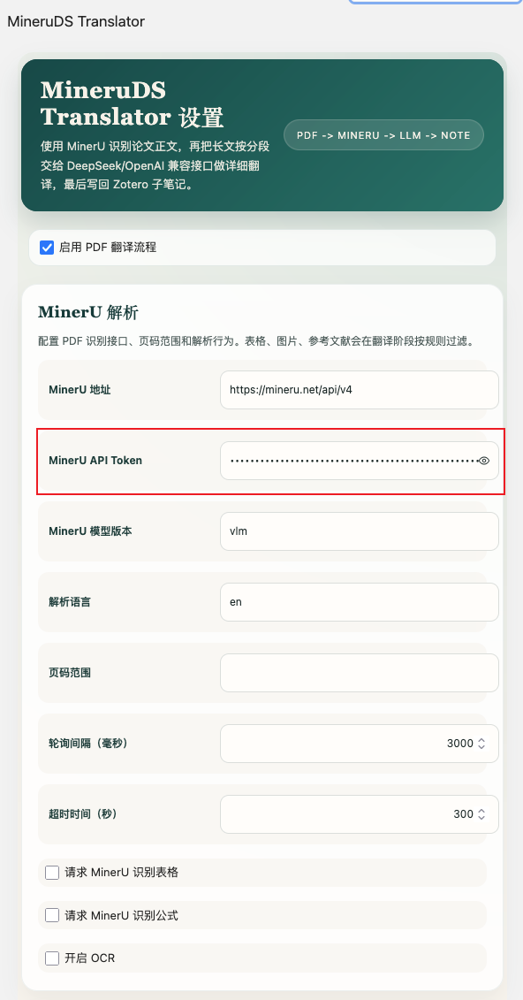
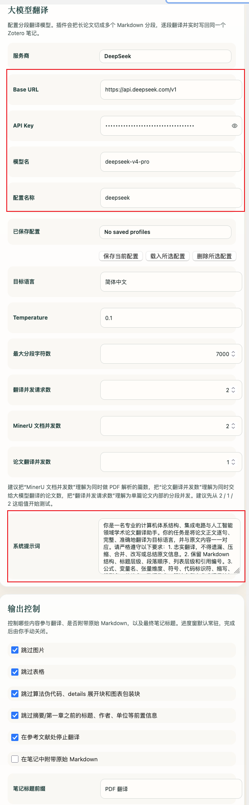

# MineruDS Translator

[](https://www.zotero.org/)
[](https://github.com/windingwind/zotero-plugin-template)

MineruDS Translator 是一个 Zotero 7 论文翻译插件。它会把 Zotero
中的 PDF 发送到 MinerU 解析成 Markdown，再调用 DeepSeek / OpenAI
兼容的大模型接口分段翻译，并把译文持续写回同一个 Zotero 子笔记。

适合的使用场景：

- 想在 Zotero 里直接翻译整篇 PDF 论文
- 希望先用 MinerU 解析版面，再让大模型翻译正文
- 希望跳过图片、表格、公式代码块和参考文献，减少无效翻译成本
- 希望一边翻译一边把结果保存到 Zotero 笔记里



## 安装

1. 前往
   [GitHub Releases](https://github.com/Futuresxy/Zotero-MinerU-Translator/releases)
   下载最新版本的 `mineruds-translator.xpi`。
2. 打开 Zotero，进入 `Tools -> Add-ons`。
3. 点击右上角齿轮图标，选择 `Install Add-on From File...`。
4. 选择刚下载的 `mineruds-translator.xpi`，安装后按提示重启 Zotero。

## 快速开始

### 1. 准备 API Key

你至少需要准备两个 Key：

- MinerU API Token：用于解析 PDF 正文
- 大模型 API Key：用于翻译 Markdown 分段，例如 DeepSeek、OpenAI、火山方舟或其他 OpenAI
  兼容服务

### 2. 打开插件设置

在 Zotero 中进入：

```text
Tools -> Plugins -> MineruDS Translator -> Preferences
```

先确认已启用 `PDF 翻译流程`，然后填写 MinerU 配置：



常用填写方式：

- `MinerU 地址`：`https://mineru.net/api/v4`
- `MinerU API Token`：填写你的 MinerU Token
- `MinerU 模型版本`：通常可填写 `vlm`
- `解析语言`：英文论文可填写 `en`

### 3. 配置翻译模型

在 `大模型翻译` 区域选择服务商并填写模型配置。以 DeepSeek 为例：



推荐先用下面这组配置测试：

- `服务商`：`DeepSeek`
- `Base URL`：`https://api.deepseek.com/v1`
- `API Key`：填写你的 DeepSeek API Key
- `模型名`：`deepseek-chat` 或你账号可用的 DeepSeek 模型名
- `目标语言`：`简体中文`
- `最大分段字符数`：`7000`
- `翻译并发请求数`：`1` 或 `2`
- `MinerU 文档并发数`：`2`
- `论文翻译并发数`：`1`

如果你刚开始使用，建议先保持较低并发，确认 MinerU 和模型接口都能稳定返回后再提高。

### 4. 在 Zotero 中翻译 PDF

1. 在 Zotero 主列表中选中一个 PDF 附件，或选中包含 PDF 附件的父条目。
2. 右键点击条目，选择 `翻译 PDF 并写入笔记`。
3. 插件会自动进入队列：上传 PDF、等待 MinerU 解析、分段翻译、持续写入 Zotero
   子笔记。
4. 翻译完成后，在该条目下查看生成的 Zotero 笔记。

## 当前实现

1. 在 Zotero 条目右键菜单中增加 `翻译 PDF 并写入笔记`
2. 支持选中 PDF 附件，或选中包含 PDF 附件的父条目
3. 调用 MinerU `POST /api/v4/file-urls/batch` 申请上传链接
4. PUT 上传 PDF 文件，自动触发 MinerU 解析
5. 轮询 `GET /api/v4/extract-results/batch/{batch_id}`
6. 下载返回 zip，并提取 `full.md`
7. 过滤图片、表格、参考文献区块，避免进入最终译文
8. 按字符数切分 Markdown，并对超长分段失败场景自动二次拆分重试
9. 调用 OpenAI 兼容 `POST /chat/completions` 或 `POST /responses`
10. 将译文实时写回同一个 Zotero 子笔记，进度窗保持显示，直到手动关闭

## 已支持的翻译提供方

- `openai`
- `deepseek`
- `doubao`
- `custom`

默认 Base URL：

- `openai` -> `https://api.openai.com/v1`
- `deepseek` -> `https://api.deepseek.com/v1`
- `doubao` -> `https://ark.cn-beijing.volces.com/api/v3`

说明：

- 插件现在同时支持 `.../chat/completions` 和 `.../responses`
- 如果你填写的是完整 endpoint，例如 `https://ark.cn-beijing.volces.com/api/v3/responses`，插件会直接按该地址请求，不再额外拼接路径

## 设置项参考

在 Zotero 中打开：

- `Tools -> Plugins -> MineruDS Translator -> Preferences`

至少需要配置：

- `mineruApiToken`
- `translationProvider`
- `translationApiKey`
- `translationModel`

常用可选项：

- `mineruModelVersion`
- `translationBaseURL`
- `translationTargetLanguage`
- `translationChunkChars`
- `includeOriginalMarkdown`
- `translationConcurrency`

## 可直接尝试的翻译配置

只需要填写对应的 Key 即可：

### 1. 火山方舟 Responses API

- `translationProvider` -> `volcano ark`
- `translationBaseURL` -> `https://ark.cn-beijing.volces.com/api/v3/responses`
- `translationModel` -> `doubao-seed-1-8-251228`

可选模型：

- `doubao-seed-1-8-251228`
- `doubao-1-5-pro-32k-250115`
- `doubao-pro-32k`

### 2. DeepSeek OpenAI Compatible API

- `translationProvider` -> `deepseek`
- `translationBaseURL` -> `https://api.deepseek.com/v1`
- `translationModel` -> `deepseek-chat`

可选模型：

- `deepseek-chat`
- `deepseek-reasoner`

### 3. OpenAI Compatible API

- `translationProvider` -> `openai`
- `translationBaseURL` -> `https://api.openai.com/v1`
- `translationModel` -> `gpt-4.1-mini`

可选模型：

- `gpt-4.1-mini`
- `gpt-4.1`
- `gpt-4o-mini`

### 4. 自定义 OpenAI Compatible 服务

- `translationProvider` -> `custom`
- `translationBaseURL` -> `https://<your-host>/v1`
- `translationModel` -> `<your-model-name>`

## 开发

```bash
npm install
npm start
```

生产构建：

```bash
npm run build
```

批量翻译脚本：

```bash
MINERU_API_TOKEN="<your-mineru-token>" \
TRANSLATION_API_KEY="<your-key>" \
npm run batch:translate -- \
  --input example \
  --extractor mineru \
  --base-url https://ark.cn-beijing.volces.com/api/v3/responses \
  --model doubao-seed-1-8-251228 \
  --output-dir batch-output
```

说明：

- 提供 `MINERU_API_TOKEN` 时，脚本会优先走 MinerU，并在翻译前过滤图片、表格和参考文献
- 不提供 MinerU Token 时，会回退到本机 `pdftotext`，这时无法保留 MinerU 识别出的图片和表格 Markdown
- 默认只输出 `*.translated.md`

打包产物：

- `.scaffold/build/mineruds-translator.xpi`

## GitHub 仓库初始化

当前仓库保留现有 GitHub release 工作流配置，构建产物名称已调整为 `mineruds-translator.xpi`，方便直接沿用当前仓库发布 release。

如果你以后要切到别的 GitHub 仓库，执行：

```bash
git remote set-url origin https://github.com/<your-user>/<your-repo>.git
```

如果你想要干净历史，建议新建 GitHub 空仓库后重新初始化：

```bash
rm -rf .git
git init
git add .
git commit -m "Initial commit"
git branch -M main
git remote add origin https://github.com/<your-user>/<your-repo>.git
```

## 注意事项

- 不建议把 MinerU Token 或 LLM API Key 提交到仓库。
- 当前版本默认只生成一个翻译子笔记；如启用 `includeOriginalMarkdown`，会把 MinerU 原始 Markdown 附在同一条笔记后部。
- 不同服务商的模型名可能会变化，请以你账号后台展示的可用模型为准。
- 当前实现已通过 `npm run build` 打包验证。
